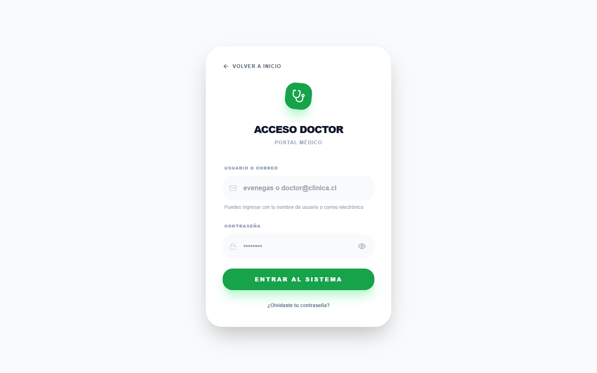
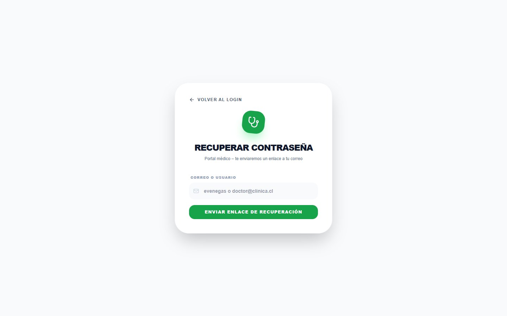
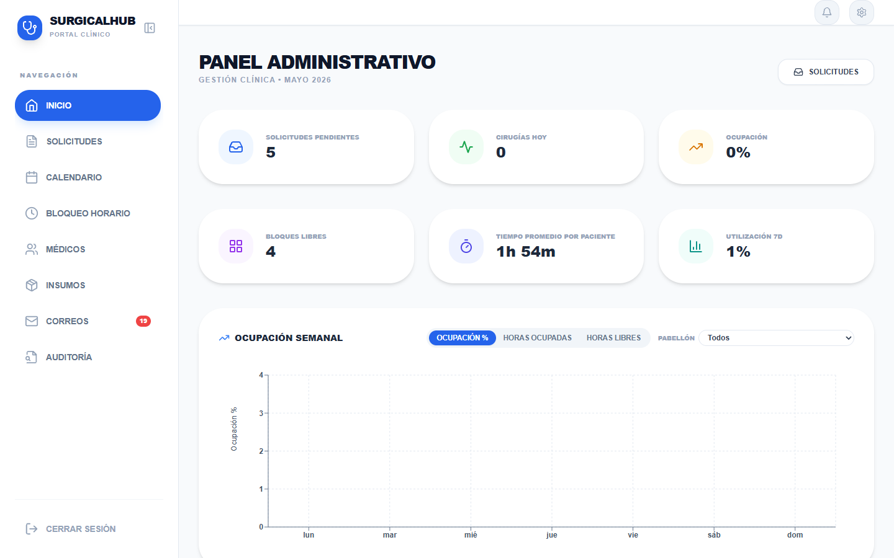
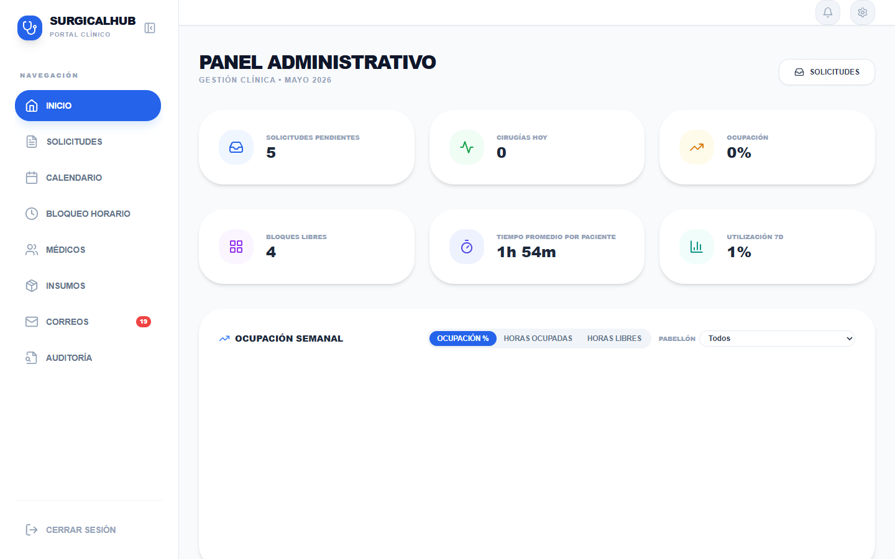

# QuirúrgicaPro — Manual de Usuario
## Rol: Médico / Cirujano

**Versión:** 1.0  
**Fecha:** Mayo 2026  
**Sistema:** QuirúrgicaPro — Gestión de Cirugías y Pabellones

---

## Índice

1. [Introducción](#introducción)
2. [Acceso al Sistema](#acceso-al-sistema)
3. [Flujo Típico de Trabajo](#flujo-típico-de-trabajo)
4. [Dashboard — Pantalla Principal](#dashboard--pantalla-principal)
5. [Crear Solicitud de Cirugía](#crear-solicitud-de-cirugía)
6. [Mis Solicitudes](#mis-solicitudes)
7. [Calendario](#calendario)
8. [Horarios Disponibles](#horarios-disponibles)
9. [Notificaciones](#notificaciones)
10. [Preguntas Frecuentes](#preguntas-frecuentes)

---

## Introducción

**QuirúrgicaPro** es una plataforma en línea diseñada para simplificar la coordinación quirúrgica en clínicas y hospitales. Como médico, usted la utiliza para:

- Solicitar pabellón y fecha para las cirugías de sus pacientes
- Hacer seguimiento del estado de cada solicitud
- Consultar su agenda quirúrgica personal
- Ver los recordatorios y confirmaciones del equipo de pabellón

El sistema conecta directamente al cirujano con el equipo de coordinación de pabellón, eliminando llamadas telefónicas, correos duplicados y planillas manuales. Todo queda registrado, trazable y accesible desde cualquier computador o dispositivo con navegador.

> **No se requieren conocimientos técnicos avanzados.** Este manual explica cada pantalla paso a paso, con el lenguaje cotidiano de la práctica clínica.

---

## Acceso al Sistema

1. Abra su navegador web (Chrome, Edge o Firefox recomendados).
2. Ingrese a la dirección que le proporcionó su clínica.
3. Introduzca su correo electrónico institucional (o nombre de usuario) y contraseña.
4. Haga clic en **Iniciar sesión**.



Si olvidó su contraseña, utilice la opción **"¿Olvidaste tu contraseña?"** en la pantalla de inicio. Recibirá un correo con instrucciones para restablecerla.



> Si su cuenta no aparece o tiene problemas para ingresar, comuníquese con el administrador del sistema de su clínica.

---

## Flujo Típico de Trabajo

A continuación se describe el proceso completo desde que usted solicita una cirugía hasta el día de la intervención. Este es el ciclo habitual en QuirúrgicaPro.

```
1. Usted crea una solicitud de cirugía para su paciente
         ↓
2. El equipo de pabellón revisa la solicitud
         ↓
3. Pabellón acepta o rechaza la solicitud
         ↓
4. Usted recibe una notificación con la fecha y pabellón confirmados
         ↓
5. El día de la cirugía, la ve en su Dashboard y Calendario
```

### Descripción de cada etapa

**Etapa 1 — Usted crea la solicitud**  
Desde la sección **Crear Solicitud**, completa los datos del paciente, el tipo de cirugía, los insumos requeridos y sus preferencias de horario. La solicitud queda registrada con estado **Pendiente**.

**Etapa 2 — Pabellón revisa**  
El equipo de coordinación de pabellón recibe su solicitud automáticamente. Ellos verifican disponibilidad de quirófano, insumos y recursos.

**Etapa 3 — Aceptación o rechazo**  
- Si la cirugía es **aceptada**: se le asigna fecha, hora y pabellón específico.  
- Si es **rechazada**: recibirá el motivo para que pueda hacer los ajustes necesarios y volver a solicitar.

**Etapa 4 — Usted recibe la confirmación**  
Una notificación aparecerá en el sistema (y, dependiendo de la configuración, por correo electrónico) con todos los detalles de la cirugía programada.

**Etapa 5 — Día de la cirugía**  
La cirugía aparece en su **Dashboard** con el detalle de sala y horario, y en su **Calendario** personal.

---

## Dashboard — Pantalla Principal

El Dashboard es la primera pantalla que ve al iniciar sesión. Está diseñada para darle una visión rápida de su actividad quirúrgica del día y las próximas fechas.



### Saludo y fecha

En la parte superior verá un saludo personalizado con su nombre y la fecha de hoy. Esto le permite confirmar de inmediato que está viendo información actualizada.

### Tarjetas de resumen (KPIs)

Justo debajo del saludo, encontrará tres tarjetas con los números más importantes:

| Tarjeta | Qué muestra |
|---|---|
| **Cirugías Hoy** | Cantidad de cirugías que tiene programadas para el día de hoy |
| **Solicitudes Pendientes** | Solicitudes que usted ha enviado y aún no han sido respondidas por pabellón |
| **Cirugías Confirmadas** | Total de cirugías futuras ya confirmadas en su agenda |

### Panel izquierdo — Cirugías de Hoy

Muestra el listado de todas las cirugías programadas para el día actual. Por cada cirugía verá:

- Nombre del paciente
- Pabellón (quirófano) asignado
- Hora de inicio
- Estado actual (por ejemplo: **Programada**, **En curso**, **Finalizada**)

Este panel se actualiza en tiempo real durante el día.

### Panel derecho — Muro de Recordatorios

El **Muro de Recordatorios** es un tablón donde aparecen avisos importantes relacionados con sus cirugías. Puede contener:

- **Tarjetas verdes (cirugías aceptadas):** Cada vez que pabellón confirma una de sus solicitudes, aparece aquí una tarjeta con:
  - Nombre del paciente
  - Fecha y hora confirmadas
  - Pabellón asignado
  - Código de operación (ej.: QP-2026-0042)
  - Si la cirugía fue **reagendada** respecto a una fecha anterior, verá la fecha original tachada con la nota *"esta fecha ya no aplica"*, y la nueva fecha confirmada debajo.

- **Recordatorios generales:** Avisos del equipo de pabellón que aplican a todos los médicos (cambios de procedimiento, mantenimientos programados, etc.).

- **Enlace al Calendario:** Un acceso directo para ver la cirugía confirmada dentro de su calendario personal.

### Panel inferior — Próximas Cirugías Confirmadas

Lista cronológica de todas sus cirugías confirmadas a futuro. Por cada cirugía verá:

- Nombre del paciente
- Fecha y hora programadas
- Pabellón asignado
- Estado con su etiqueta de color: **Programada** (azul) o **Reagendada** (naranja/amarillo)

Use esta sección para planificar su semana o mes de manera rápida sin necesidad de abrir el calendario completo.

---

## Crear Solicitud de Cirugía

Esta es la sección más importante del sistema para usted como médico. Aquí registra todos los detalles de una cirugía que desea programar para un paciente.

Acceda desde el menú lateral haciendo clic en **Crear Solicitud**.


El formulario está dividido en cinco partes:

---

### Parte 1 — Datos del Paciente

Ingrese los datos de identificación del paciente:

| Campo | Descripción |
|---|---|
| **RUT** | Ingrese el RUT chileno del paciente con guión y dígito verificador (ej.: 12.345.678-9). El sistema lo valida automáticamente. |
| **Nombre** | Primer nombre del paciente |
| **Apellido** | Apellido del paciente |
| **Teléfono** | Número de celular para notificaciones por WhatsApp. Seleccione primero el código de país con la bandera correspondiente. |
| **Correo electrónico** | Opcional. Si lo ingresa, el paciente puede recibir notificaciones por correo. |
| **Fecha de nacimiento** | Seleccione desde el calendario desplegable |
| **Tipo de previsión** | Elija entre **Isapre**, **Fonasa** o **Particular** |

> **Consejo:** Si el RUT ingresado no es válido, el campo se marcará en rojo. Verifique el dígito verificador antes de continuar.

---

### Parte 2 — Datos de la Cirugía

Detalle la intervención quirúrgica:

| Campo | Descripción |
|---|---|
| **Código de operación** | Se genera automáticamente con el formato **QP-AAAA-XXXX**. No es necesario que usted lo ingrese. |
| **Tipo de cirugía / descripción** | Describa el procedimiento quirúrgico (ej.: "Colecistectomía laparoscópica") |
| **Duración estimada** | Seleccione las horas y minutos que calcula durará la intervención |
| **Rango de fechas preferido** | Indique una fecha "desde" y una fecha "hasta" dentro de la cual le acomoda que se programe la cirugía |
| **Observaciones / notas adicionales** | Campo libre para indicar requerimientos especiales, antecedentes relevantes o cualquier información que deba conocer el equipo de pabellón |

---

### Parte 3 — Insumos Requeridos

Registre los materiales e insumos quirúrgicos que necesitará para la intervención.

#### Agregar insumos uno a uno

1. Use el buscador para encontrar un insumo del inventario de la clínica.
2. Selecciónelo de la lista desplegable.
3. Indique la **cantidad** requerida.
4. Haga clic en **Agregar** para incorporarlo a la lista.

#### Usar un Pack de Insumos

Un **pack** es un conjunto predefinido de insumos agrupados para un tipo de cirugía específico (por ejemplo: "Pack Laparoscopía Básica"). Al seleccionar un pack, el sistema completa automáticamente todos los ítems incluidos en él, ahorrándole tiempo.

Para usar un pack:

1. Haga clic en **Seleccionar Pack**.
2. Elija el pack correspondiente a su tipo de cirugía.
3. El sistema agregará todos los insumos del pack. Puede luego agregar ítems adicionales o ajustar cantidades.

> **Consejo:** Si realiza frecuentemente el mismo tipo de cirugía, pregunte al administrador si existe un pack configurado para ese procedimiento.

---

### Parte 4 — Preferencias de Horario

Esta sección muestra una **grilla semanal** para que usted indique los horarios que le son convenientes.

- Las **columnas** representan los distintos pabellones (quirófanos) disponibles.
- Las **filas** representan los bloques horarios del día, de 8:00 a 19:00, en intervalos de 30 minutos.

#### Cómo marcar sus preferencias

1. Identifique el pabellón y el horario que le conviene.
2. Haga clic en el bloque correspondiente. Se resaltará indicando que está seleccionado.
3. Puede seleccionar múltiples bloques si tiene flexibilidad de horario.
4. Para desmarcar un bloque, haga clic nuevamente sobre él.

#### Colores y estados de los bloques

| Color | Significado |
|---|---|
| **Disponible (sin color / blanco)** | El bloque está libre y puede ser solicitado |
| **Seleccionado (resaltado)** | Usted ha marcado este bloque como preferencia |
| **Gris / Bloqueado** | El bloque no está disponible (ya ocupado o fuera de horario) |

> **Nota importante:** El **Pabellón 1** aparece siempre en gris. Está reservado por contrato y no está disponible para solicitudes de cirugía programadas.

---

### Parte 5 — Orden de Hospitalización

Al final del formulario encontrará una opción especial:

**"El paciente tiene orden de hospitalización sin fecha asignada"**

Marque esta casilla cuando su paciente cuenta con una orden de hospitalización emitida, pero aún no tiene una fecha definitiva de ingreso.

Al activar esta opción:
- La solicitud quedará registrada con un indicador especial.
- En el panel de pabellón aparecerá una **alerta de color naranja** que llama la atención del equipo coordinador para gestionar la fecha con prioridad.

---

### Envío de la solicitud

Una vez completados todos los campos requeridos, haga clic en el botón **Enviar Solicitud** al final del formulario.

- La solicitud quedará registrada con estado **Pendiente**.
- El equipo de pabellón la recibirá de inmediato.
- Usted podrá hacer seguimiento desde la sección **Mis Solicitudes**.

---

## Mis Solicitudes

En esta sección puede revisar el historial completo de todas las solicitudes de cirugía que ha enviado, con su estado actual.

Acceda desde el menú lateral haciendo clic en **Mis Solicitudes**.


### Filtros de estado

En la parte superior encontrará botones para filtrar la lista:

- **Todas** — Muestra todas sus solicitudes sin distinción
- **Pendiente** — Solicitudes enviadas que aún no han sido respondidas
- **Aceptada** — Solicitudes aprobadas por pabellón
- **Rechazada** — Solicitudes que no fueron aprobadas

### Información por solicitud

Cada solicitud aparece como una tarjeta con los siguientes datos:

| Dato | Descripción |
|---|---|
| **Nombre del paciente** | Identificación del paciente |
| **Código de operación** | Código único (QP-AAAA-XXXX) asignado al crear la solicitud |
| **Fecha de solicitud** | Día en que usted envió la solicitud |
| **Estado** | Etiqueta de color según el estado actual |

#### Si la solicitud fue **aceptada**, verá además:
- Fecha y hora confirmadas para la cirugía
- Pabellón asignado

#### Si la solicitud fue **rechazada**, verá:
- El motivo del rechazo indicado por el equipo de pabellón
- Con esta información podrá ajustar la solicitud y volver a enviarla si corresponde.

#### Si la cirugía fue **reagendada**, verá:
- La nueva fecha con la etiqueta **(reagendada)** junto a ella
- La fecha original puede aparecer como referencia

---

## Calendario

El **Calendario** le muestra su agenda quirúrgica personal de forma visual.

Acceda desde el menú lateral haciendo clic en **Calendario**.


### Vistas disponibles

Puede cambiar la vista según su necesidad:

| Vista | Utilidad |
|---|---|
| **Mes** | Ver el panorama general de todo el mes |
| **Semana** | Ver los detalles de la semana actual o una semana específica |
| **Día** | Ver en detalle todos los bloques de un día puntual |

Utilice los botones de navegación (flechas izquierda y derecha) para avanzar o retroceder en el tiempo.

### Código de colores

Cada evento en el calendario tiene un color según el estado de la cirugía:

- **Azul:** Programada (confirmada)
- **Gris / Tachado:** Cancelada
- Otros colores pueden indicar estados adicionales según la configuración de su clínica

### Restricciones

El calendario es de **solo lectura**. Usted puede consultar sus cirugías, pero no puede modificarlas ni reagendarlas desde aquí. Cualquier cambio debe gestionarse a través del equipo de pabellón.

---

## Horarios Disponibles

Esta sección le muestra los bloques de tiempo libre que existen en los pabellones para los próximos días.

Úsela **antes de crear una solicitud** para saber qué fechas y horarios tienen mayor disponibilidad, y así indicar preferencias que tengan más posibilidad de ser asignadas.



La información que verá incluye:
- Qué días de la semana tienen bloques libres
- En qué pabellón están disponibles esos bloques
- Los rangos horarios específicos disponibles

> **Recomendación:** Revise esta sección cuando vaya a crear una solicitud para un paciente que tenga urgencia de fecha, de modo que pueda indicar preferencias reales y acelerar la confirmación.

---

## Notificaciones

QuirúrgicaPro le informa sobre cambios importantes en sus solicitudes. Las notificaciones pueden aparecer:

- Dentro del sistema (ícono de campana en la barra superior)
- En el **Muro de Recordatorios** del Dashboard
- Por correo electrónico (si está configurado en su perfil)

### Tipos de notificaciones que recibirá

| Evento | Qué se notifica |
|---|---|
| **Solicitud aceptada** | Fecha, hora y pabellón confirmados para la cirugía |
| **Solicitud rechazada** | Motivo del rechazo |
| **Cirugía reagendada** | Nueva fecha y hora, con referencia a la fecha original |
| **Recordatorio general** | Avisos del equipo de pabellón |

---

## Preguntas Frecuentes

### ¿Qué hago si mi solicitud es rechazada?

Cuando una solicitud es rechazada, verá el motivo indicado en la tarjeta dentro de **Mis Solicitudes**. Los motivos más comunes son: falta de disponibilidad de pabellón, insumos no disponibles en la fecha solicitada, o información incompleta en el formulario.

Con esa información, puede:
1. Corregir o completar los datos que se señalan.
2. Ajustar las fechas o preferencias de horario.
3. Crear una nueva solicitud con los cambios aplicados.

Si cree que el rechazo fue un error, comuníquese directamente con el equipo de coordinación de pabellón.

---

### ¿Cómo sé cuándo mi solicitud ha sido aceptada?

Recibirá una notificación dentro del sistema. Verá:

- Una tarjeta verde en el **Muro de Recordatorios** del Dashboard con la fecha, hora y pabellón confirmados.
- La solicitud cambiará a estado **Aceptada** en **Mis Solicitudes**.
- Dependiendo de la configuración de su clínica, también puede llegar una notificación por correo electrónico.

El código de operación (QP-AAAA-XXXX) es el mismo desde que usted creó la solicitud, lo que le permite identificarla fácilmente en cualquier momento.

---

### ¿Qué es un "pack de insumos"?

Un pack de insumos es una lista predefinida de materiales quirúrgicos agrupados para un tipo de procedimiento específico. Por ejemplo, un **"Pack Colecistectomía Laparoscópica"** podría incluir trócares, clips, bolsas de extracción y otros elementos estándar para ese procedimiento.

Al seleccionar un pack al crear su solicitud, el sistema carga automáticamente todos esos ítems con las cantidades habituales, evitando que tenga que agregarlos uno por uno. Usted siempre puede ajustar cantidades o agregar insumos adicionales después de aplicar el pack.

Si un procedimiento que realiza frecuentemente no tiene pack configurado, puede solicitarle al administrador del sistema que lo cree.

---

### ¿Qué significa "orden de hospitalización sin fecha"?

Esta opción indica que su paciente ya cuenta con una **orden médica de hospitalización emitida**, pero todavía no tiene una fecha definitiva asignada para su ingreso y cirugía.

Al marcar esta casilla en el formulario de solicitud:

- La solicitud queda registrada con un indicador especial de prioridad.
- En el panel del equipo de pabellón aparece una **alerta naranja** que señala que este paciente requiere coordinación de fecha con cierta urgencia.

Es útil cuando un paciente necesita programarse pronto pero aún está pendiente la confirmación de su previsión de salud, cama disponible u otros trámites administrativos.

---

*Para consultas técnicas o problemas de acceso, contacte al administrador del sistema de su clínica.*

*Manual elaborado para QuirúrgicaPro v1.0 — Mayo 2026*
