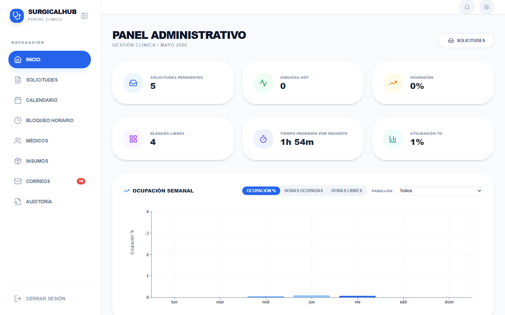
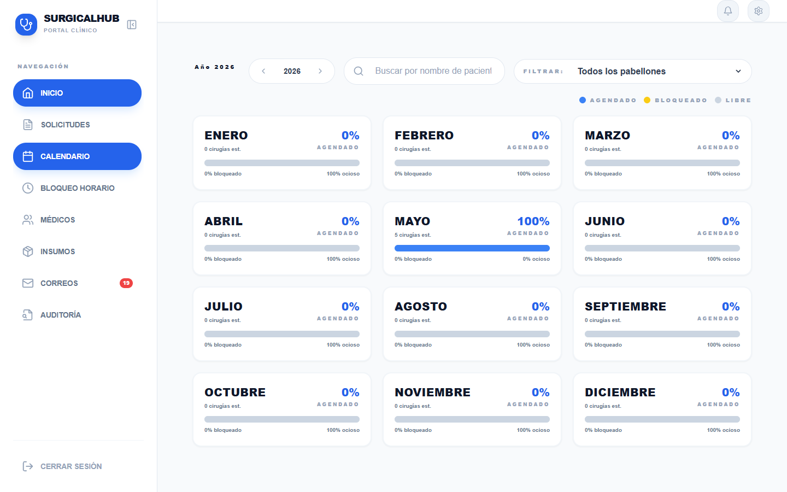
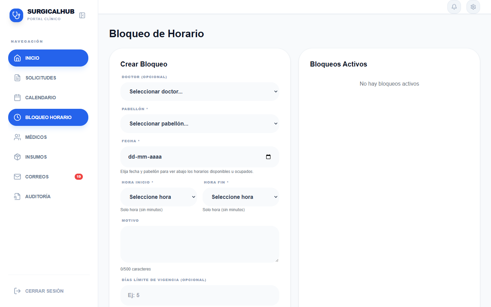
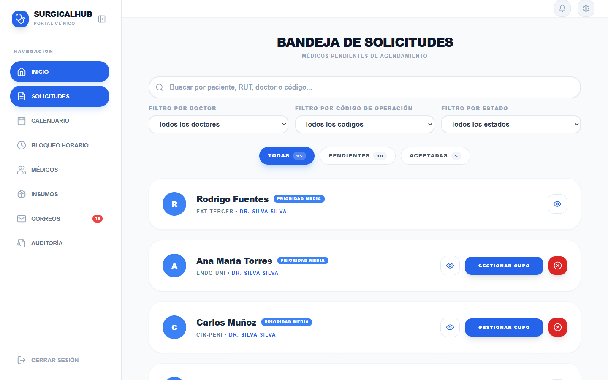
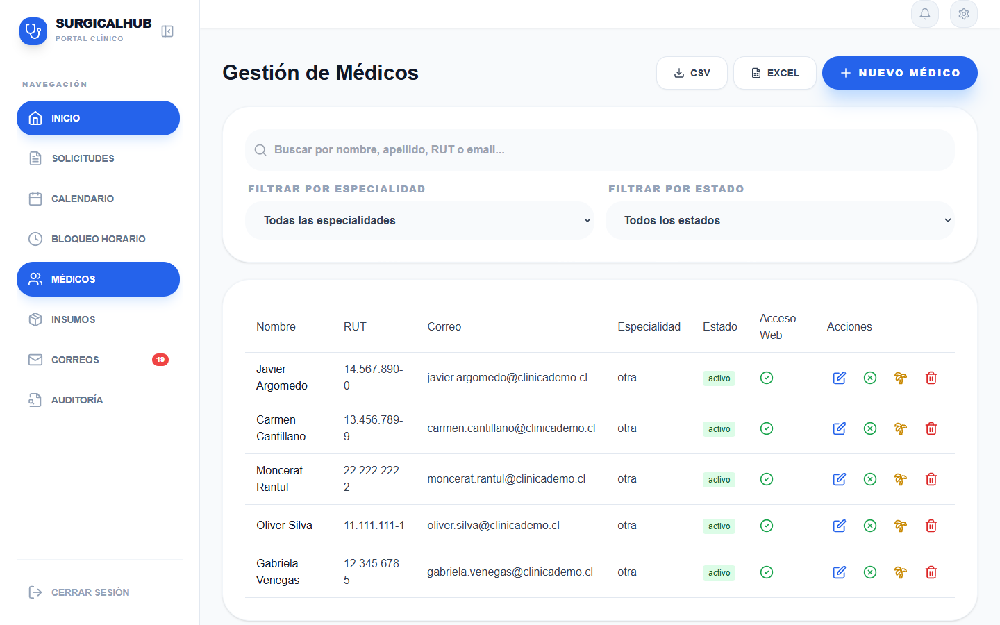
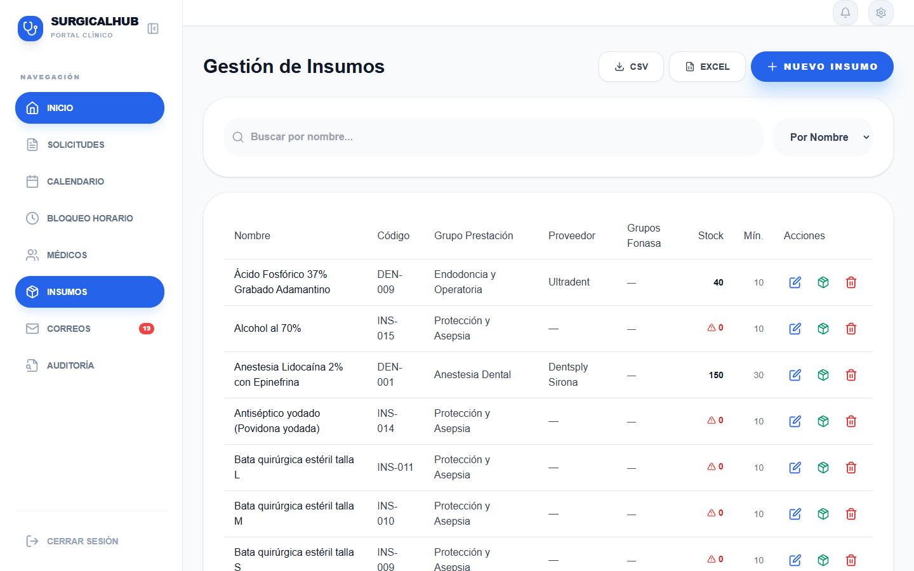
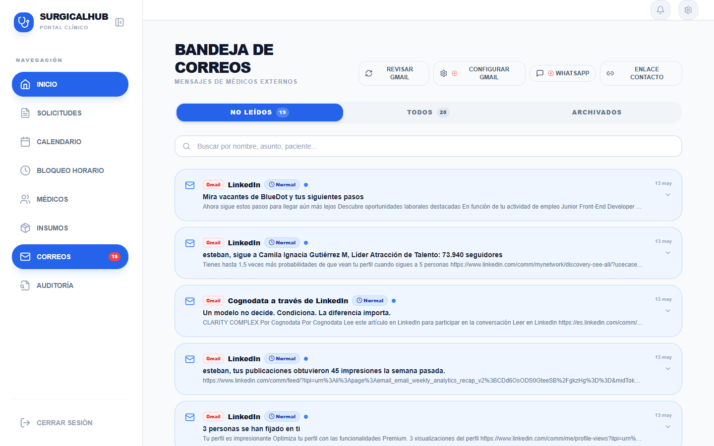
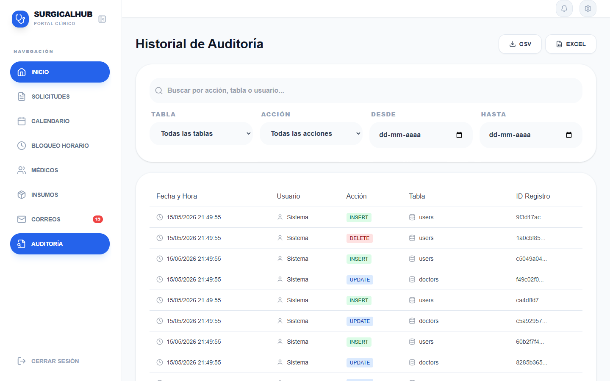

# Manual de Usuario — QuirúrgicaPro
## Módulo de Gestión de Pabellón

**Versión:** 1.0  
**Fecha:** Mayo 2026  
**Dirigido a:** Personal administrativo de pabellón quirúrgico

---

## Tabla de Contenidos

1. [Introducción](#1-introducción)
2. [Panel Administrativo (Dashboard)](#2-panel-administrativo-dashboard)
3. [Calendario](#3-calendario)
4. [Solicitudes de Cirugía](#4-solicitudes-de-cirugía)
5. [Médicos](#5-médicos)
6. [Insumos](#6-insumos)
7. [Correos](#7-correos)
8. [Auditoría](#8-auditoría)
9. [Preguntas Frecuentes](#9-preguntas-frecuentes)

---

## 1. Introducción

### ¿Qué es QuirúrgicaPro?

QuirúrgicaPro es una plataforma web de gestión clínica diseñada para centralizar y optimizar la administración de pabellones quirúrgicos. Desde un único sistema, el equipo administrativo puede programar cirugías, gestionar la disponibilidad de pabellones, coordinar con los médicos, controlar el inventario de insumos y hacer seguimiento de todas las actividades del centro.

El sistema está pensado para reducir la carga administrativa, minimizar errores de coordinación y mantener un registro claro y auditable de todas las operaciones del pabellón.

### Acceso al sistema

Para ingresar, abra su navegador y acceda a la dirección proporcionada por su clínica. Ingrese con su correo electrónico y contraseña de administrador de pabellón.

### El rol de Gestión de Pabellón

Como personal de pabellón con acceso administrativo, usted es responsable de:

- Recibir y gestionar las solicitudes de cirugía enviadas por los médicos.
- Programar intervenciones en los pabellones disponibles.
- Mantener actualizado el registro de médicos e insumos.
- Comunicarse con médicos y pacientes a través del módulo de correos.
- Consultar el registro de auditoría cuando sea necesario.

Este manual cubre cada una de estas funciones con instrucciones claras y paso a paso.

---

## 2. Panel Administrativo (Dashboard)

El Dashboard es la pantalla principal que verá al iniciar sesión. Está diseñado para darle una visión rápida del estado del pabellón durante el día.

### 2.1 Indicadores principales (KPIs superiores)

En la parte superior encontrará tres tarjetas de resumen:

| Indicador | Qué significa |
|---|---|
| **Solicitudes Pendientes** | Número de solicitudes de cirugía enviadas por médicos que aún no han sido aceptadas ni rechazadas. |
| **Cirugías Hoy** | Cantidad de cirugías programadas para el día de hoy. Haga clic en esta tarjeta para ver el detalle de cada cirugía. |
| **Ocupación %** | Porcentaje de pabellones que están en uso en este momento. |

### 2.2 Indicadores secundarios

Debajo de los principales, hay tres tarjetas adicionales con información de contexto:

- **Bloques libres:** Cantidad de bloques horarios disponibles en los pabellones para el día de hoy.
- **Tiempo promedio por paciente:** Duración media de las cirugías realizadas en los últimos 30 días. Útil para planificar la agenda.
- **Utilización 7d:** Porcentaje de utilización de los pabellones en los últimos 7 días.

### 2.3 Alerta naranja: Órdenes de hospitalización sin programar

Cuando existen órdenes de hospitalización que aún no tienen una cirugía asignada, aparecerá un **banner de aviso de color naranja** en la parte superior del Dashboard.

Este banner muestra los nombres de los pacientes afectados y un botón **"Ver solicitudes"**. Al hacer clic, el sistema lo llevará directamente al módulo de Solicitudes para que pueda atenderlas con prioridad.

> **Atención:** No ignore este aviso. Las órdenes de hospitalización sin programar pueden implicar pacientes en espera activa.

### 2.4 Gráfico de ocupación semanal

El gráfico de barras muestra la ocupación de los pabellones a lo largo de la semana actual. Puede personalizarlo de dos formas:

- **Tipo de dato:** Use el selector para ver la información como _Ocupación %_, _Horas ocupadas_ o _Horas libres_.
- **Filtro por pabellón:** Use el menú desplegable para ver todos los pabellones en conjunto o enfocarse en uno específico.

Este gráfico es especialmente útil para identificar días con alta demanda o pabellones subutilizados.

### 2.5 Lista de solicitudes pendientes

Justo debajo del gráfico, el Dashboard muestra las últimas 5 solicitudes de cirugía pendientes. Puede hacer clic en cualquiera de ellas para ir directamente al módulo de Solicitudes y gestionarla.

### 2.6 Muro de Recordatorios

En la parte inferior del Dashboard encontrará el **Muro de Recordatorios**, una herramienta personal para anotar tareas pendientes o información importante del día.

**Cómo usarlo:**

1. Escriba su nota en el campo de texto (máximo 150 caracteres).
2. Presione **Enter** o haga clic en el botón **+** para guardar la nota.
3. Cuando complete una tarea, haga clic en el icono de **check verde** para marcarla como realizada.
4. Para eliminar una nota, haga clic en el icono de **papelera roja**.

> Los recordatorios son personales: solo usted los ve.

---

## 3. Calendario

El módulo de Calendario ofrece una vista completa de la programación de todos los pabellones quirúrgicos.

### 3.1 Navegación del calendario

Al ingresar al módulo, verá el calendario con todas las cirugías programadas organizadas por pabellón. Puede cambiar la vista según sus necesidades:

- **Vista diaria:** Muestra hora a hora todas las intervenciones del día.
- **Vista semanal:** Visión general de la semana en curso.
- **Vista mensual:** Panorama completo del mes.

Use los controles de navegación (flechas o botón de fecha) para avanzar o retroceder en el tiempo.

### 3.2 Pabellones y color de cirugías

Cada pabellón aparece como una franja (lane) horizontal o vertical. Las cirugías programadas se muestran como bloques de color para facilitar la identificación rápida.

### 3.3 Pabellón 1 — Bloqueo por convenio

El **Pabellón 1** está reservado bajo contrato de convenio. Esto significa que **no puede programarse libremente** desde el sistema. Cualquier solicitud que requiera ese pabellón debe coordinarse según los términos del convenio correspondiente.

### 3.4 Crear un bloqueo de horario

Si necesita marcar un período como no disponible (por ejemplo, por mantención, limpieza o reserva especial), puede crear un bloque de horario desde el módulo dedicado:

1. Seleccione el rango de tiempo que desea bloquear en el calendario.
2. Seleccione la opción **"Bloquear horario"**.
3. Confirme el pabellón y el período.

El tiempo bloqueado quedará marcado en el calendario y no estará disponible para nuevas programaciones durante ese período.

---

## 4. Solicitudes de Cirugía

Este es uno de los módulos más importantes de su trabajo diario. Aquí llegan todas las solicitudes enviadas por los médicos, y desde aquí usted las acepta, rechaza o reagenda.

### 4.1 Vista general de solicitudes

Al ingresar al módulo verá una lista de todas las solicitudes con su estado actual:

- **Pendiente:** Aún no ha sido gestionada.
- **Aceptada:** Se programó y confirmó al médico.
- **Rechazada:** Se negó con un motivo.

**Filtros disponibles:**
- Filtre por estado para ver solo las solicitudes pendientes, aceptadas o rechazadas.
- Use el buscador para localizar una solicitud por nombre de paciente u otro dato.

### 4.2 Gestionar una solicitud

Haga clic en cualquier solicitud para abrir el modal de **Gestión de Programación**. Este panel contiene toda la información necesaria para tomar una decisión:

**Información del paciente:**
- Nombre completo y RUT
- Datos de contacto

**Información de la cirugía:**
- Código de operación
- Tipo de intervención
- Insumos y equipamiento requerido

**Grilla de programación:**
- Un calendario interactivo donde puede seleccionar la fecha y el bloque horario disponible.

### 4.3 Aceptar una solicitud

1. Revise los datos del paciente y la cirugía.
2. En la grilla de programación, seleccione la **fecha** y el **bloque horario** deseado.
3. Asigne el **pabellón** correspondiente.
4. Haga clic en **Aceptar**.

Al confirmar, el sistema:
- Crea la entrada de cirugía en el calendario.
- Envía una notificación automática al médico con la fecha, hora y pabellón confirmados.

### 4.4 Rechazar una solicitud

1. Abra la solicitud.
2. Haga clic en el botón **Rechazar**.
3. Ingrese el **motivo del rechazo** (campo obligatorio).
4. Confirme.

El médico recibirá una notificación informando el rechazo y el motivo indicado.

> Siempre sea claro y preciso en el motivo del rechazo para evitar confusiones con el médico solicitante.

### 4.5 Reagendar una cirugía (Reagendar)

Si necesita mover una cirugía ya aceptada a una nueva fecha u horario sin rechazarla:

1. Abra la solicitud correspondiente.
2. Seleccione la opción **Reagendar**.
3. Elija la nueva fecha y bloque horario en la grilla.
4. Confirme el cambio.

La solicitud se actualizará con el nuevo horario sin pasar por el estado de "rechazada". El médico será notificado del cambio.

---

## 5. Médicos

El módulo de Médicos le permite administrar el registro de facultativos habilitados para operar en el pabellón.

### 5.1 Ver la lista de médicos

Al ingresar, verá todos los médicos registrados con su información básica:

- Nombre completo
- Especialidad
- Correo electrónico
- Teléfono de contacto

### 5.2 Agregar un nuevo médico

1. Haga clic en el botón **"Agregar médico"**.
2. Complete los datos requeridos: nombre, especialidad, correo electrónico y teléfono.
3. Confirme el registro.

Al crear el médico, el sistema **envía automáticamente un correo de invitación** a la dirección ingresada para que el médico pueda acceder a la plataforma.

### 5.3 Editar información de un médico

1. Localice al médico en la lista.
2. Haga clic en el ícono de **edición** (lápiz).
3. Modifique los campos necesarios: especialidad, correo, teléfono, días disponibles.
4. Guarde los cambios.

> Los médicos también pueden definir sus propios bloques de disponibilidad horaria desde su panel. Esto se refleja automáticamente en el calendario y en la grilla de programación de solicitudes.

### 5.4 Desactivar o reactivar un médico

Si un médico deja de operar en el pabellón (temporal o permanentemente), puede desactivarlo sin eliminar su historial:

1. Haga clic en el ícono correspondiente al médico.
2. Seleccione **Desactivar**.

Para reactivarlo en el futuro, siga el mismo proceso y seleccione **Reactivar**.

Un médico desactivado no aparecerá disponible al programar nuevas cirugías.

---

## 6. Insumos

El módulo de Insumos permite controlar el inventario de materiales quirúrgicos y equipamiento disponible en el pabellón.

### 6.1 Ver el inventario

La pantalla principal muestra todos los insumos registrados con:

- Nombre del ítem
- Categoría
- Unidad de medida
- Cantidad en stock

### 6.2 Agregar un insumo

1. Haga clic en **"Agregar insumo"**.
2. Ingrese el nombre, categoría, unidad y cantidad inicial en stock.
3. Guarde el registro.

### 6.3 Editar un insumo

1. Localice el insumo en la lista.
2. Haga clic en el ícono de edición.
3. Actualice los campos que correspondan (nombre, categoría, stock, etc.).
4. Guarde los cambios.

### 6.4 Eliminar un insumo

1. Haga clic en el ícono de **eliminar** (papelera) junto al insumo.
2. Confirme la acción.

> Elimine insumos solo cuando ya no sean utilizados en el pabellón. Si un insumo tiene stock en cero pero aún se usa ocasionalmente, es preferible dejarlo registrado con cantidad 0 antes que eliminarlo.

### 6.5 Packs de insumos

Los packs son grupos de insumos predefinidos que se utilizan frecuentemente juntos en un mismo tipo de cirugía.

- Cuando se selecciona un pack al programar una cirugía, los insumos del pack se agregan automáticamente a la solicitud.
- Esto simplifica el proceso de verificación de materiales al revisar una solicitud en el módulo de Solicitudes.

### 6.6 Relación con las solicitudes

Cuando un médico envía una solicitud de cirugía e indica los insumos o equipamiento que requiere, esos ítems aparecerán visibles en el modal de **Gestión de Programación** dentro del módulo de Solicitudes. Esto le permite verificar disponibilidad antes de aceptar la intervención.

---

## 7. Correos

El módulo de Correos permite enviar y recibir mensajes directamente desde QuirúrgicaPro, integrado con una cuenta de Gmail del pabellón.

### 7.1 Configuración inicial (Gmail OAuth)

Antes de usar el módulo de correos por primera vez, debe vincular una cuenta de Gmail:

1. Ingrese al módulo **Correos**.
2. Haga clic en el botón **"Configurar Gmail"**.
3. Ingrese las credenciales OAuth proporcionadas por su administrador de sistemas:
   - `Client ID`
   - `Client Secret`
   - `Refresh Token`
4. Guarde la configuración.

Una vez configurado, el sistema se conectará a la cuenta de Gmail y cargará los mensajes entrantes.

> Si no dispone de estas credenciales, contacte al administrador del sistema o al equipo de soporte de QuirúrgicaPro.

### 7.2 Leer correos entrantes

Al ingresar al módulo verá la bandeja de entrada con los mensajes recibidos en la cuenta configurada. Haga clic en cualquier mensaje para leerlo.

### 7.3 Enviar un correo

1. Haga clic en el botón de **"Redactar"** o equivalente.
2. Ingrese el destinatario (puede ser un médico o paciente).
3. Escriba el asunto y el cuerpo del mensaje.
4. Haga clic en **Enviar**.

El correo se enviará desde la cuenta de Gmail vinculada al pabellón.

> Use este módulo para comunicaciones formales con médicos (confirmaciones, cambios de horario) y con pacientes cuando sea necesario.

---

## 8. Auditoría

El módulo de Auditoría es un registro completo e inmutable de todas las acciones realizadas en el sistema.

### 8.1 ¿Para qué sirve?

La auditoría permite:

- Saber quién realizó cada acción y cuándo.
- Verificar cambios en solicitudes, médicos, insumos y configuraciones.
- Resolver dudas o disputas sobre el historial de una cirugía o solicitud.
- Cumplir con requisitos de trazabilidad en entornos clínicos.

### 8.2 Ver el registro de auditoría

Al ingresar al módulo, verá una tabla cronológica con cada evento registrado, que incluye:

- **Usuario:** Quién realizó la acción.
- **Acción:** Qué hizo (ej. "Aceptó solicitud", "Creó médico", "Eliminó insumo").
- **Fecha y hora:** Cuándo ocurrió.

### 8.3 Filtrar registros

Para encontrar eventos específicos, puede combinar los siguientes filtros:

- **Por usuario:** Ver solo las acciones de un miembro del equipo en particular.
- **Por tipo de acción:** Filtrar por categoría de evento (ej. solo cambios en solicitudes).
- **Por rango de fechas:** Acotar el período que desea revisar.

### 8.4 Importante: el registro es de solo lectura

El módulo de Auditoría **no permite modificar ni eliminar registros**. Esto es intencional: garantiza que el historial sea confiable y no pueda ser alterado.

---

## 9. Preguntas Frecuentes

### ¿Qué hago si la solicitud de un médico no aparece en el listado?

Primero, verifique que los filtros de estado no estén ocultando la solicitud:

1. Asegúrese de que el filtro de estado esté configurado en **"Todos"** o en **"Pendiente"**.
2. Limpie cualquier texto del buscador que pueda estar filtrando resultados.
3. Recargue la página.

Si después de estos pasos la solicitud sigue sin aparecer, es posible que el médico no haya enviado la solicitud correctamente desde su panel. Contacte al médico para que verifique el estado del envío en su cuenta. Si el problema persiste, comuníquese con el equipo de soporte de QuirúrgicaPro.

---

### ¿Cómo manejo una reagendación urgente?

Cuando necesite mover una cirugía con urgencia (por ejemplo, por una emergencia en pabellón o cancelación de último minuto):

1. Ingrese al módulo de **Solicitudes** y localice la cirugía afectada.
2. Abra la solicitud y seleccione la opción **Reagendar**.
3. Elija la nueva fecha y horario disponible.
4. Confirme el cambio.

El médico recibirá una notificación automática con el nuevo horario. Si la situación lo requiere, use el módulo de **Correos** para enviar un mensaje adicional con más contexto o instrucciones especiales.

> Para reasignaciones muy urgentes donde el médico necesita confirmación inmediata, complementar la notificación automática del sistema con una llamada telefónica directa siempre es una buena práctica.

---

### ¿Qué significa el banner naranja en el Dashboard?

El banner naranja indica que existen **órdenes de hospitalización que no tienen una cirugía programada asignada**. Es decir, hay pacientes con una orden activa esperando que se les asigne fecha y pabellón.

El banner muestra los nombres de los pacientes en esa situación. Para resolverlo:

1. Haga clic en el botón **"Ver solicitudes"** dentro del banner.
2. El sistema lo llevará al módulo de Solicitudes.
3. Identifique las solicitudes pendientes correspondientes a esos pacientes.
4. Acéptelas asignando fecha, hora y pabellón.

Una vez que todas las órdenes estén programadas, el banner desaparecerá automáticamente.

---

*Para consultas técnicas o soporte adicional, contacte al equipo de QuirúrgicaPro.*
